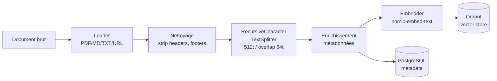

# ADR-0003 — Stratégie de chunking des documents

| Champ       | Valeur                          |
|-------------|---------------------------------|
| Statut      | **Accepté**                     |
| Date        | 2026-06-29                      |
| Décideurs   | équipe projet                   |
| Tags        | ingestion, chunking, qualité    |

## Contexte

La qualité de la retrieval dans un RAG dépend directement du découpage des documents en chunks. Un chunk trop grand noie le signal, trop petit perd le contexte. Le chunker doit :

- Respecter les frontières sémantiques (paragraphes, sections)
- Produire des chunks de taille stable pour l'embedding
- Conserver le contexte via un overlap entre chunks adjacents
- Gérer les formats hétérogènes (PDF, Markdown, TXT, HTML)

## Stratégies évaluées

| Stratégie              | Avantage                        | Inconvénient                    |
|------------------------|---------------------------------|---------------------------------|
| Fixed-size (chars)     | Simple, prévisible              | Coupe au milieu des phrases     |
| Sentence splitting     | Frontières propres              | Chunks de taille très variable  |
| Recursive char splitter| Respecte \n\n > \n > . > espace | Légèrement plus lent            |
| Semantic chunking      | Optimal pour la qualité         | Nécessite un 2e modèle          |
| Token-based            | Exactement N tokens             | Dépendant du tokenizer LLM      |

## Décision

**`RecursiveCharacterTextSplitter`** de LangChain avec les paramètres suivants :

```python
chunk_size    = 512   # tokens ~= 384 chars pour nomic-embed-text
chunk_overlap = 64    # ~12.5% d'overlap
separators    = ["\n\n", "\n", ". ", " ", ""]
```

**Justification des valeurs :**
- `512` tokens : fenêtre optimale pour nomic-embed-text (context max = 2048, mais la qualité d'embedding chute au-delà de 512 tokens selon le papier original).
- `64` tokens d'overlap : préserve la continuité entre chunks sans doubler le volume de vecteurs.
- Séparateurs récursifs : priorité aux doubles sauts de ligne (sections Markdown, paragraphes PDF) avant de couper à la phrase.

## Métadonnées par chunk

Chaque chunk stocké dans Qdrant embarque un payload JSON :

```json
{
  "doc_id":       "uuid-du-document-parent",
  "chunk_index":  3,
  "chunk_total":  12,
  "source":       "rapport-q1-2026.pdf",
  "source_type":  "pdf",
  "page":         5,
  "char_start":   1024,
  "char_end":     1536,
  "ingested_at":  "2026-06-29T06:00:00Z",
  "collection":   "finance"
}
```

## Diagramme du pipeline de chunking



## Conséquences

- **Positif** : Reproductible et testable — même input → même découpage.
- **Positif** : Compatible avec tous les formats via les loaders LangChain.
- **Négatif** : Le chunk_size en caractères est une approximation du nombre de tokens — une validation par tokenizer est ajoutée en post-processing.
- **Point de vigilance** : Les PDF avec tableaux ou colonnes multiples produisent du texte mal ordonné après extraction — un pre-processing spécifique sera ajouté en v1.1.

## Révision prévue

Évaluer le semantic chunking (clustering par similarité cosine) si la qualité de retrieval mesurée par RAGAS < 0.7 sur le jeu de test.
