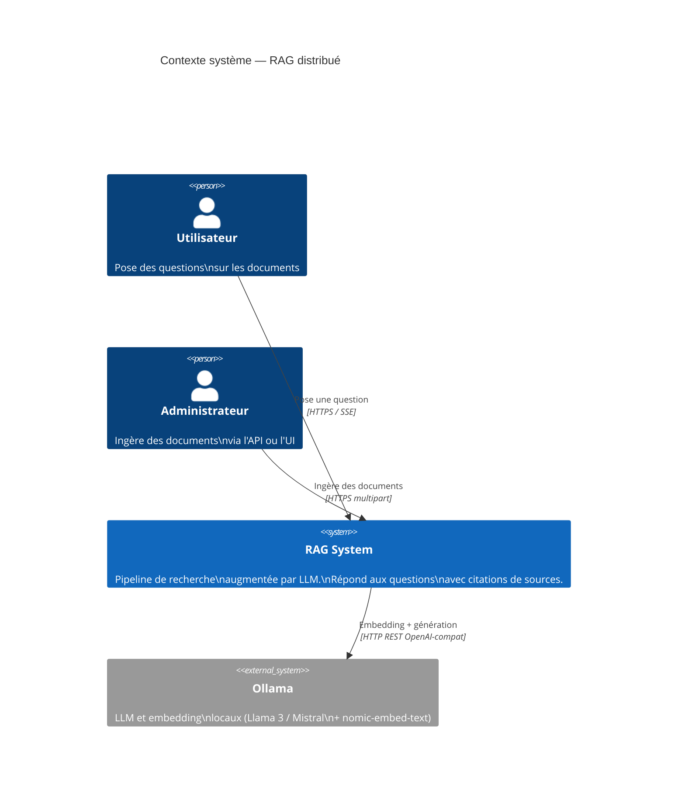
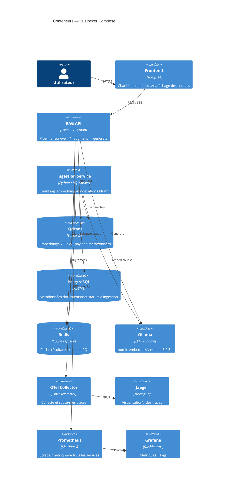
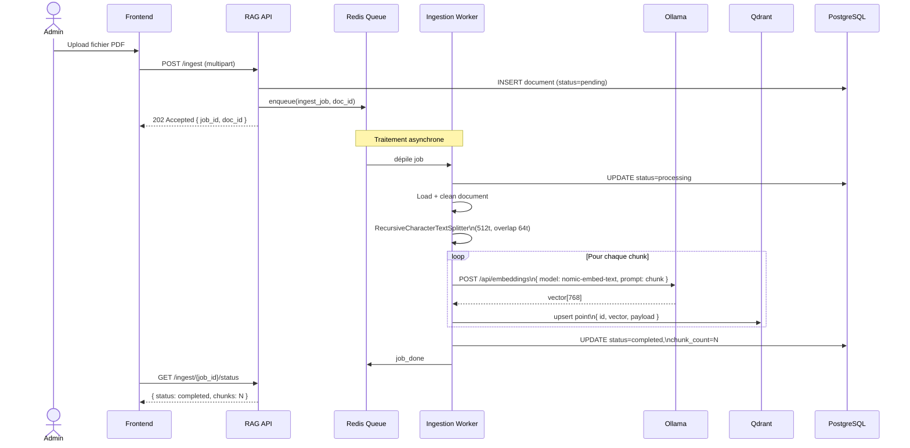
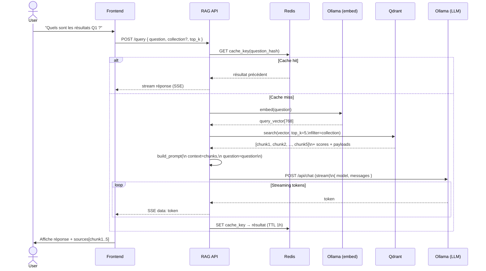
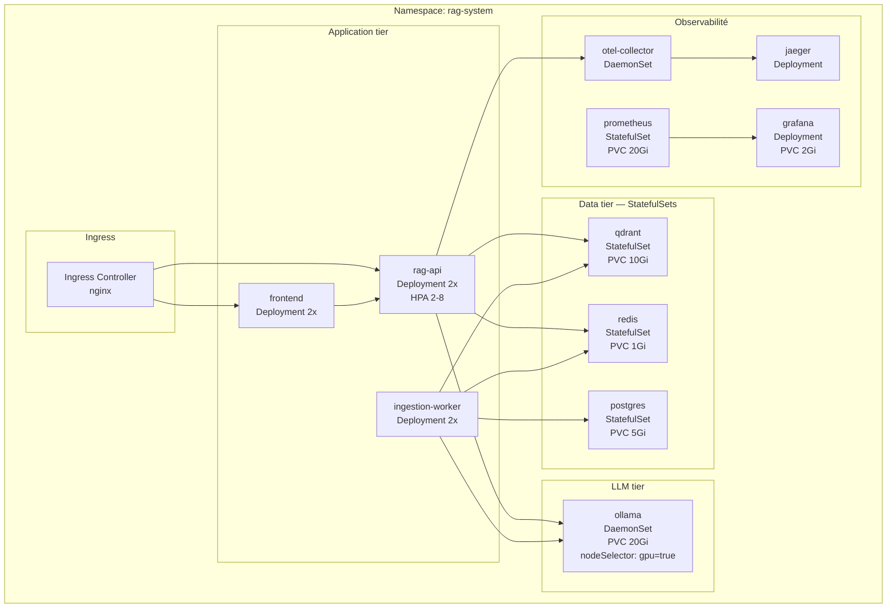
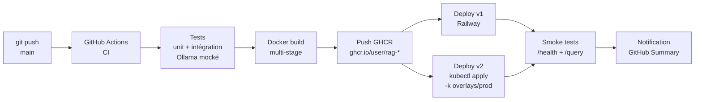

# Diagrammes d'architecture — RAG System

Tous les diagrammes sont en Mermaid et peuvent être rendus sur GitHub, dans Obsidian, ou via `mmdc`.

---

## 1. Vue C4 — Contexte système

---

## 2. Vue C4 — Conteneurs (v1 Docker Compose)

---

## 3. Flux d'ingestion d'un document

---

## 4. Flux de requête RAG

---

## 5. Architecture k8s v2

---

## 6. Pipeline CI/CD

